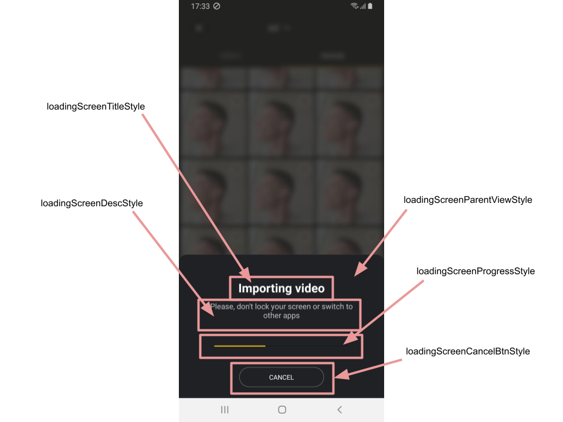

# Loading screen

## Overview

Loading screen is a part of Banuba Video Editor flow.

It is being shown during 

- uploading files from gallery

- exporting video


## Appearance customization

Loading screen is provided by default with Banuba Video Editor and it is fully customizable.

To change appearance of different parts of the screen you should provide your own styles implementations for the following theme attributes:

- **loadingScreenParentViewStyle** for the main view container
- **loadingScreenTitleStyle** for the title styling
- **loadingScreenDescStyle** for the description styling
- **loadingScreenProgressStyle** for the SeekBar which represents the progress of long running task
- **loadingCancelBtnStyle** for the cancel button at the bottom of the screen

NOTE: To change just a single parameter (i.e. background or textSize), inherit your style from the corresponding default style.



**You should not setup text directly in TextView styles for title and description** because the loading screen is used in different cases (for uploading and export) and the static text may not be suitable for both situation and will be confusing.

To localize or to change the text displayed on the title and on the description you can override the following string resources:

 - for uploading flow: **loading_import_title**, **loading_import_description**
 - for export flow: **loading_export_title**, **loading_export_description**

## Using own screen

If you want to provide your own loading screen you should follow the next steps:

1. Implement the LoadingDialogProvider interface

    ```kotlin
        interface LoadingDialogProvider {

            fun show(
                fragmentManager: FragmentManager,
                loadingType: LoadingType,
                doOnCancel: () -> Unit = {}
            )

            fun hide(fragmentManager: FragmentManager)

            fun publishProgress(@IntRange(from = 0, to = 100) progress: Int)
    }
    ```

2. Provide your implementation through Koin module:

    ```kotlin
        single<LoadingDialogProvider> { YourCustomLoadingDialogProvider() }
    ```
