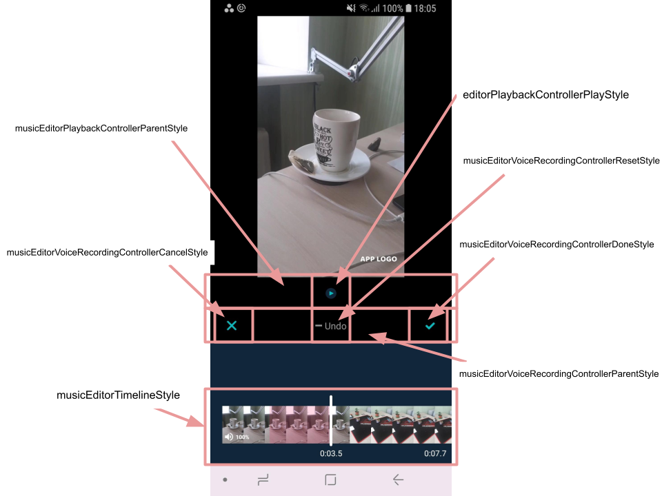
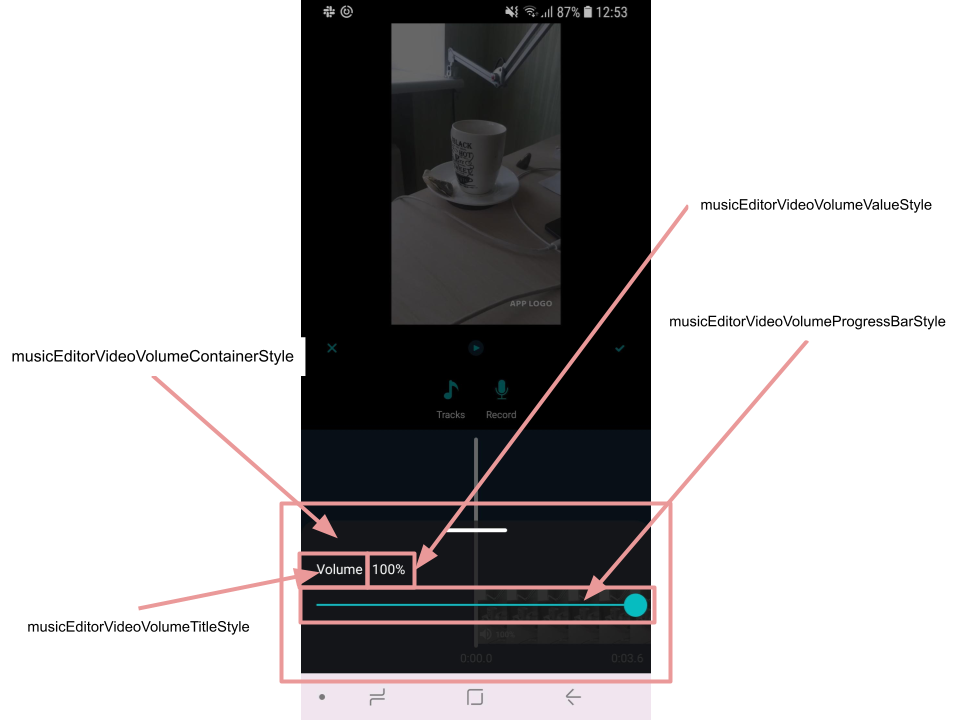

# Banuba VideoEditor SDK
## Music Editor screen styles

- [musicEditorStyle](https://github.com/Banuba/ve-sdk-android-integration-sample/blob/main/app/src/main/res/values/themes.xml#L139)

    style that setups drawables for playback and voice recording icons

- [musicEditorTimelineStyle](https://github.com/Banuba/ve-sdk-android-integration-sample/blob/main/app/src/main/res/values/themes.xml#L140)

    style for the complex view that contains applied music tracks, video timeline, video volume button. It has a lot of custom attributes appliceable to children views

- [musicEditorTimelineTimeTextStyle](https://github.com/Banuba/ve-sdk-android-integration-sample/blob/main/app/src/main/res/values/themes.xml#L141)

    style for TextViews that represent current pointer's position and the whole video duration

- [musicEditorTimelineSoundWaveStyle](https://github.com/Banuba/ve-sdk-android-integration-sample/blob/main/app/src/main/res/values/themes.xml#L146)

    style for the view that represents added music effect on the timeline view. It configured with a lot of custom attributes

- [musicEditorActionButtonParentStyle](https://github.com/Banuba/ve-sdk-android-integration-sample/blob/main/app/src/main/res/values/themes.xml#L142)

    style for the ConstraintLayout that is used as container for every action button

- [musicEditorActionButtonStyle](https://github.com/Banuba/ve-sdk-android-integration-sample/blob/main/app/src/main/res/values/themes.xml#L143)

    style for the ImageView representing an icon for action button. Drawables for all action buttons in music editor are configured in custom theme attributes:
    - [music_editor_icon_tracks](https://github.com/Banuba/ve-sdk-android-integration-sample/blob/main/app/src/main/res/values/themes.xml#L165) - to open music track selection
    - [music_editor_icon_effects](https://github.com/Banuba/ve-sdk-android-integration-sample/blob/main/app/src/main/res/values/themes.xml#L166) - to open music effect selection. Recently deprecated
    - [music_editor_icon_track_recording](https://github.com/Banuba/ve-sdk-android-integration-sample/blob/main/app/src/main/res/values/themes.xml#L167) - to show voice recording screen
    - [music_editor_icon_track_edit](https://github.com/Banuba/ve-sdk-android-integration-sample/blob/main/app/src/main/res/values/themes.xml#L168) - to open music trimmer for the selected music track
    - [music_editor_icon_track_delete](https://github.com/Banuba/ve-sdk-android-integration-sample/blob/main/app/src/main/res/values/themes.xml#L169) - to delete selected music track

- [musicEditorActionButtonTextStyle](https://github.com/Banuba/ve-sdk-android-integration-sample/blob/main/app/src/main/res/values/themes.xml#L144)

    style for action button title

- [timelineEditorBoardStyle](https://github.com/Banuba/ve-sdk-android-integration-sample/blob/main/app/src/main/res/values/themes.xml#L145)

    style for an invisible view that holds applied graphic effects. This view is similar to [editorBoardStyle](editor_styles.md#L86) and has several custom attributes to configure its behavior

- [musicEditorRecordingButtonStyle](https://github.com/Banuba/ve-sdk-android-integration-sample/blob/main/app/src/main/res/values/themes.xml#L152)

    style for the button that starts and stops voice recording. It has several custom attributes to setup different drawables for its states

- [musicEditorVideoVolumeStyle](https://github.com/Banuba/ve-sdk-android-integration-sample/blob/main/app/src/main/res/values/themes.xml#L148)

    style to configure custom view that is used to setup video volume. All children views (label, progress bar, "done" button) are configured by custom attributes within this style

- [musicEditorVideoVolumeContainerBackground](https://github.com/Banuba/ve-sdk-android-integration-sample/blob/main/app/src/main/res/values/themes.xml#L149)

    attribute for the drawable that covers the video while volume view is active

- [hideBottomViewsInEditVolume](https://github.com/Banuba/ve-sdk-android-integration-sample/blob/main/app/src/main/res/values/themes.xml#L150) - custom theme attribute that defines if music editor controls are visible while video volume view is opened

- [musicEditorTrimViewStyle](https://github.com/Banuba/ve-sdk-android-integration-sample/blob/main/app/src/main/res/values/themes.xml#L154)

    style for the view that is used to trim music effects. This style is applied to the bottom sheet dialog and all children views configuration are available through custom attributes 

- [musicEditorTrimmerStyle](https://github.com/Banuba/ve-sdk-android-integration-sample/blob/main/app/src/main/res/values/themes.xml#L155)

    style for the trim view. It has a bulk of custom attributes to cofigure colors and left/right drawables

- [musicEditorTrimmerSoundWaveStyle](https://github.com/Banuba/ve-sdk-android-integration-sample/blob/main/app/src/main/res/values/themes.xml#L155)

    style for the custom view laying behind the trimmer view. It is similar to [musicEditorTimelineSoundWaveStyle](music_editor_styles.md#L16) and has its own custom attributes as well

- [musicEditorEqualizerRecyclerStyle](https://github.com/Banuba/ve-sdk-android-integration-sample/blob/main/app/src/main/res/values/themes.xml#L158)

    style for the RecyclerView containing voice recording effects. This view is shown only while trimming voice recordings

- [musicEditorEqualizerItemStyle](https://github.com/Banuba/ve-sdk-android-integration-sample/blob/main/app/src/main/res/values/themes.xml#L159)

    style for every item within voice recording effects. This style is applied to custom view and similar to [cameraEffectsItemStyle](camera_styles.md#L38)

- [musicEditorEqualizerThrobberStyle](https://github.com/Banuba/ve-sdk-android-integration-sample/blob/main/app/src/main/res/values/themes.xml#L160)

    style for the circle progress view that is shown over the voice effect item while this effect is being applied

    

Music Editor screen also has some theme attributes that define background of some views:

- [music_editor_surface_background](https://github.com/Banuba/ve-sdk-android-integration-sample/blob/main/app/src/main/res/values/themes.xml#L162) - background of Surface view that shows the video
- [music_editor_voice_recording_background](https://github.com/Banuba/ve-sdk-android-integration-sample/blob/main/app/src/main/res/values/themes.xml#L163) - background of control panel on voice recording screen
- [music_editor_timeline_background](https://github.com/Banuba/ve-sdk-android-integration-sample/blob/main/app/src/main/res/values/themes.xml#L164) - background of [timeline view](music_editor_styles.md#L8)
- [music_editor_playback_controller_bg](https://github.com/Banuba/ve-sdk-android-integration-sample/blob/main/app/src/main/res/values/themes.xml#L165) - background of control panel on music editor screen
- [music_editor_action_container_bg](https://github.com/Banuba/ve-sdk-android-integration-sample/blob/main/app/src/main/res/values/themes.xml#L166) - background of action buttons container

