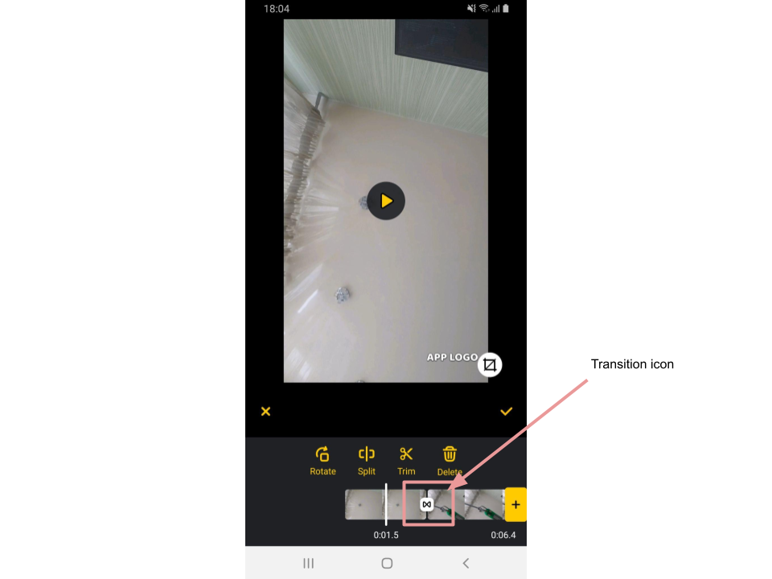
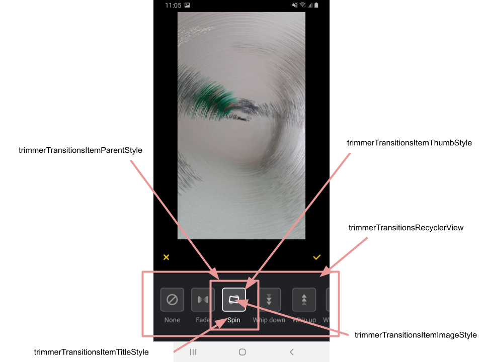

# Transition effects

**Feature is upcoming in 1.23 release.**

## Overview

Transitions are visual effects applying to the segue between two videos.

## Enabling/Disabling transitions

Transitions are provided with AI Video Editor SDK **by default**.

To disable or enable transitions set the flag ```supportsTransitions``` inside [EditorConfig](config_videoeditor.md) class into false or true respectively. 

## Transition icon view

Every applied transition presented on the trimmer screen by the transition icon on videos edges:



As a part of the trimmer timeline, styling attributes of transition icons are placed in **TrimmerTimelineViewStyle**:

- **timelineTransitionIconBg** - to setup background drawable for the icon

- **timelineTransitionIconViewSize** - to setup the whole icon size

- **timelineTransitionIconImageSize** - to setup the size of the picture inside transition icon

**The picture on the transition icon depends on the applied transition effect.** Customization of every transition effect is decribed below. 

## Selectable transition views

For transitions preview and selection there is a helper ui screen on the trimmer. 

To customize this screen there are following attributes in the main theme:

- **trimmerTransitionsRecyclerView** - for the container of transitions
- **trimmerTransitionItemParentStyle** - for the container of the single transition 
- **trimmerTransitionItemThumbStyle** - for the selectable thumb
- **trimmerTransitionsItemImageStyle** - for the picture inside the thumb
- **trimmerTransitionsItemDescriptionStyle** - for the transition title




## Customizing transition effects

There are 10 transition effects available to use within AI Video Editor SDK. Additional "empty" effect is provided to leave the segue between videos without any transition effect.

Every transition effect has its own **string identifier**: 

| Transition effect | String identifier
| --- | --- |
| Empty | "empty" |
| Fade | "fade" |
| Spin | "spin" |
| Whip Down | "whip_down"|
| Whip Up | "whip_up" |
| Whip Right | "whip_right" |
| Whip Left | "whip_left" |
| Scroll Down | "scroll_down" |
| Scroll Up | "scroll_up" |
| Scroll Right | "scroll_right" |
| Scroll Left | "scroll_left" |

The identifier is used in naming of the following android resources related to every transition effect:
- picture on the selectable thumb
- title under the selectable thumb
- picture on the transition icon on the trimmer timeline

All these resources are named within SDK according to the specific scheme:

| Customization | Resource type | Resource name template | Example
| --- | --- | --- | --- |
| thumb icon | drawable | ic_transition_thumb_{id} | ic_transition_thumb_fade
| thumb title | string | transition_effect_{id} | transition_effect_empty
| timeline icon | drawable | ic_transition_{id} | ic_transition_whip_down

In this scheme {id} is a placeholder for the effect string identifier.

To customize any effect just put your own value into android resource named according to the scheme above and place it into **app/res** folder. This resource will override the default one.

For example, to change the title of Empty transition effect to "Clear", you should place 
```xml
<string name="transition_effect_empty">Clear</string>
```
into app/res/values/strings.xml file of your app.

**Important Note!** 

Transition effects are not being played if the closest video (either to the left or to the right of transition icon) is very short. Such a behavior is attracted on the UI by utilizing selector drawables for some android resources which are used in transitions customization. All selectors has two states: `state_activated = true` and `state_activated = false`. The table below will give you an insight where you should consider to use selector while customizing transitions:

| Style or resource | Attribute for selector | Explanation
| --- | --- | --- |
| trimmerTimelineStyle | timelineTransitionIconBg | transition effect can be playable or unplayable, so the transition icon background should have two states
| trimmerTransitionsItemThumbStyle | background | transitions can be selected and unselected, so as theirs thumbs
| trimmerTransitionsItemDescriptionStyle | textColor | transitions can be selected and unselected, so as theirs titles
| ic_transition_thumb_{id} | drawable | transitions can be selected and unselected, so as theirs icons on the thumb
| ic_transition_{id} | drawable | transition effect can be playable or unplayable, so the transition icon should have two states 

